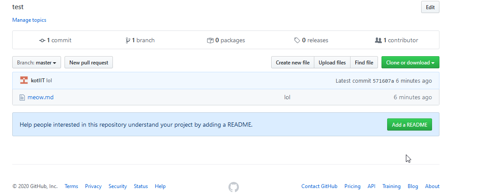
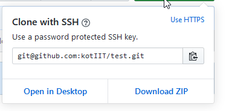
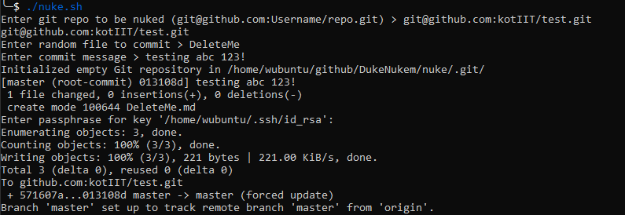
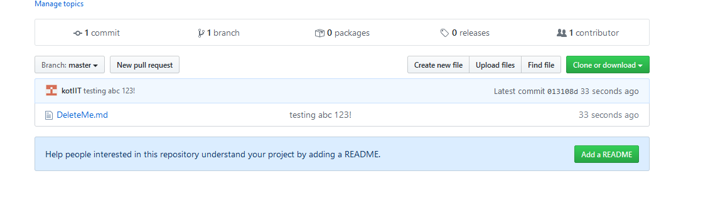

# DukeNukem

## What is this?

This tool force pushes a single commit to a Git remote, effectively deleting the entire repo's history of commits.

## Proof of Concept

### Current repo. 1 Commit. 1 branch

### Get the link to clone the repo

### Run the Script, and Enter the repo

### Repo Nuked

